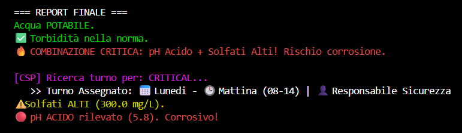
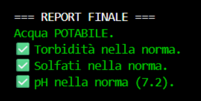
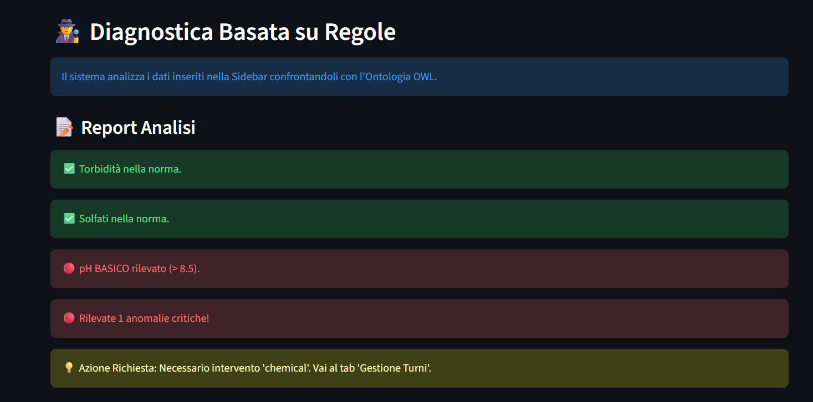
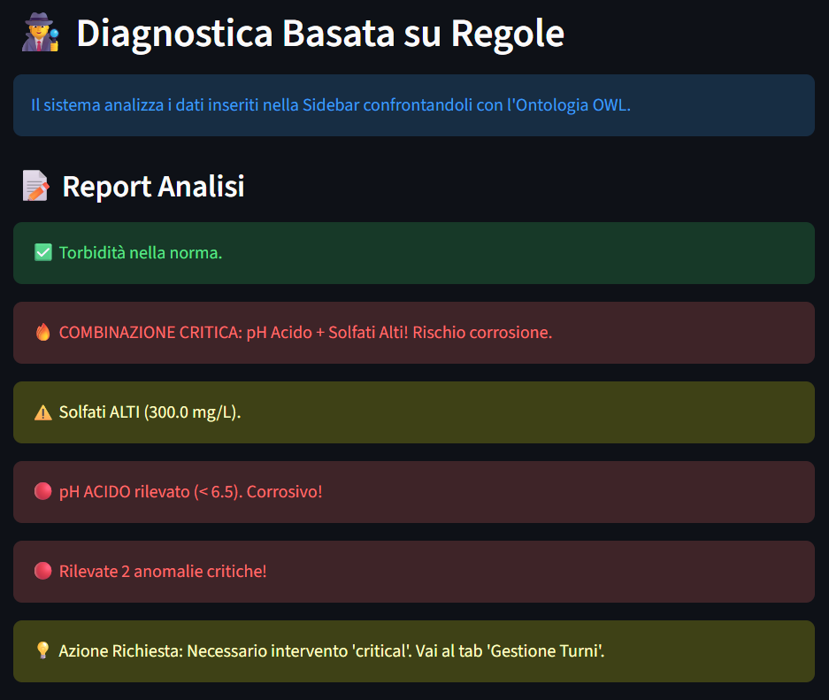
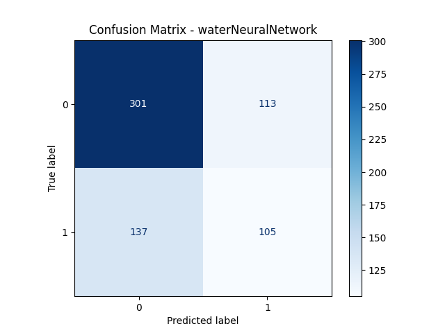
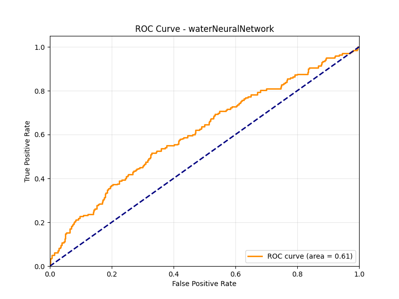
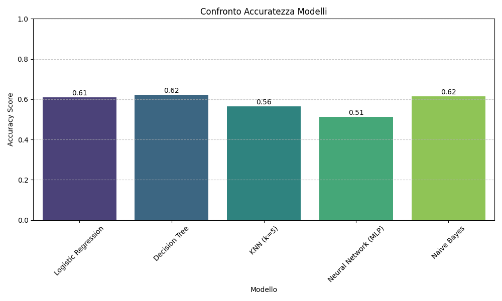

# Documentazione Progetto: Water Quality Assessment System

**Gruppo di lavoro**
* Carmine Giove, 797656, c.giove10@studenti.uniba.it
* Claudio Gualberti, 801963, c.gualberti@studenti.uniba.it

**URL repository:** https://github.com/Carmine365/Progetto_ICon_2026

**AA 2025-2026**

---

# Water Quality Assessment System   
## Sistema ibrido: Ontologia + KBS rule-based + ML + CSP

## Indice

- [0. Mappa del progetto e temi affrontati](#0-mappa-del-progetto-e-temi-affrontati)
  - [0.1 Contenuto, struttura e file principali](#01-contenuto-struttura-e-file-principali)
  - [0.2 Temi del corso coperti](#02-temi-del-corso-coperti)
  - [0.3 Cosa verrà documentato e cosa viene evitato](#03-cosa-verrà-documentato-e-cosa-viene-evitato)
  - [0.4 Modalità di esecuzione (entrypoint principali)](#04-modalità-di-esecuzione-entrypoint-principali)

- [1. Obiettivo del progetto e motivazioni](#1-obiettivo-del-progetto-e-motivazioni)
  - [1.1 Contesto e scopo pratico](#11-contesto-e-scopo-pratico)
  - [1.2 Temi del corso affrontati esplicitamente](#12-temi-del-corso-affrontati-esplicitamente)
  - [1.3 Perché un sistema ibrido (KBS + Ontologia + ML + CSP)](#13-perché-un-sistema-ibrido-kbs--ontologia--ml--csp)
    - [1.3.1 Perché non solo ML](#131-perché-non-solo-ml)
    - [1.3.2 Perché un KBS rule-based](#132-perché-un-kbs-rule-based)
    - [1.3.3 Perché un’ontologia OWL](#133-perché-unontologia-owl)
    - [1.3.4 Perché un CSP per l’azione operativa](#134-perché-un-csp-per-lazione-operativa)
  - [1.4 Risultati attesi e output del sistema](#14-risultati-attesi-e-output-del-sistema)
  - [1.5 Criteri di qualità adottati (in linea con le linee guida)](#15-criteri-di-qualità-adottati-in-linea-con-le-linee-guida)
  - [1.6 Come verrà sviluppata la documentazione (passo passo)](#16-come-verrà-sviluppata-la-documentazione-passo-passo)

- [2. Architettura del sistema e scelte progettuali](#2-architettura-del-sistema-e-scelte-progettuali)
  - [2.1 Visione architetturale generale](#21-visione-architetturale-generale)
  - [2.2 Modulo KBS: cuore del sistema](#22-modulo-kbs-cuore-del-sistema)
    - [2.2.1 File e responsabilità](#221-file-e-responsabilità)
    - [2.2.2 Scelta di un motore a regole (experta)](#222-scelta-di-un-motore-a-regole-experta)
  - [2.3 Strato semantico: Ontologia OWL](#23-strato-semantico-ontologia-owl)
    - [2.3.1 File e responsabilità](#231-file-e-responsabilità)
    - [2.3.2 Integrazione con il sistema](#232-integrazione-con-il-sistema)
  - [2.4 Modulo CSP / Scheduler](#24-modulo-csp--scheduler)
    - [2.4.1 File e responsabilità](#241-file-e-responsabilità)
    - [2.4.2 Interazione con il KBS](#242-interazione-con-il-kbs)
    - [2.4.3 Motivazione della scelta CSP](#243-motivazione-della-scelta-csp)
  - [2.5 Modulo di apprendimento automatico (ML)](#25-modulo-di-apprendimento-automatico-ml)
    - [2.5.1 File e responsabilità](#251-file-e-responsabilità)
    - [2.5.2 Motivazione della separazione dal KBS](#252-motivazione-della-separazione-dal-kbs)
  - [2.6 Flusso di esecuzione complessivo](#26-flusso-di-esecuzione-complessivo)
    - [2.6.1 Flusso KBS + CSP](#261-flusso-kbs--csp)
    - [2.6.2 Flusso ML](#262-flusso-ml)
  - [2.7 Vantaggi dell’architettura adottata](#27-vantaggi-dellarchitettura-adottata)

- [3. Knowledge-Based System (KBS) e Knowledge Base](#3-knowledge-based-system-kbs-e-knowledge-base)
  - [3.1 Ruolo del KBS nel sistema](#31-ruolo-del-kbs-nel-sistema)
  - [3.2 Scelte di implementazione e motivazioni](#32-scelte-di-implementazione-e-motivazioni)
    - [3.2.1 Motore a regole: experta](#321-motore-a-regole-experta)
    - [3.2.2 Compatibilità Python (fix per experta)](#322-compatibilità-python-fix-per-experta)
  - [3.3 Acquisizione della conoscenza e popolamento della Knowledge Base](#33-acquisizione-della-conoscenza-e-popolamento-della-knowledge-base)
    - [3.3.1 Inizializzazione della KB](#331-inizializzazione-della-kb)
    - [3.3.2 Acquisizione delle osservazioni qualitative](#332-acquisizione-delle-osservazioni-qualitative)
    - [3.3.3 Acquisizione dei parametri numerici](#333-acquisizione-dei-parametri-numerici)
  - [3.4 Regole di inferenza e catene decisionali](#34-regole-di-inferenza-e-catene-decisionali)
    - [3.4.1 Regole di controllo del flusso](#341-regole-di-controllo-del-flusso)
    - [3.4.2 Regola relazionale: Rischio Corrosione](#342-regola-relazionale-rischio-corrosione)
  - [3.5 Integrazione tra KBS e CSP (Diagnosi → Azione)](#35-integrazione-tra-kbs-e-csp-diagnosi--azione)
    - [3.5.1 Regole di attivazione dello scheduler](#351-regole-di-attivazione-dello-scheduler)
  - [3.6 Output finale del sistema esperto](#36-output-finale-del-sistema-esperto)
  - [3.7 Complessità, robustezza ed estendibilità](#37-complessità-robustezza-ed-estendibilità)
  - [3.8 Limiti del KBS e possibili miglioramenti](#38-limiti-del-kbs-e-possibili-miglioramenti)
  - [3.9 Interfaccia Grafica del sistema esperto (UI)](#39-interfaccia-grafica-del-sistema-esperto-ui))
    - [3.9.1 Caso normale con acqua potabile](#391-caso-normale-con-acqua-potabile)
    - [3.9.2 Caso di anomalia chimica](#392-caso-di-anomalia-chimica)
    - [3.9.3 Caso critico](#393-caso-critico)

- [4. Ontologia OWL: supporto semantico e inferenza opzionale](#4-ontologia-owl-supporto-semantico-e-inferenza-opzionale)
  - [4.1 Ruolo dell’ontologia: modello concettuale e classificazione semantica](#41-ruolo-dellontologia-modello-concettuale-e-classificazione-semantica)
  - [4.2 Struttura Avanzata dell’ontologia](#42-struttura-avanzata-dellontologia)
    - [4.2.1 Data Properties](#421-data-properties)
    - [4.2.2 Classi Definite (Defined Classes)](#422-classi-definite-defined-classes)
  - [4.3 Implementazione e Costruzione Programmatica](#43-implementazione-e-costruzione-programmatica)
    - [4.3.1 ontology_builder.py](#431-ontology_builderpy)
    - [4.3.2 ontology_manager.py](#432-ontology_managerpy)
  - [4.4 Inferenza con Reasoner (Pellet)](#44-inferenza-con-reasoner-pellet)
    - [4.4.1 Attivazione del reasoner OWL](#441-attivazione-del-reasoner-owl)
    - [4.4.2 Gestione del fallback](#442-gestione-del-fallback)
  - [4.5 Integrazione tra ontologia e KBS](#45-integrazione-tra-ontologia-e-kbs)
  - [4.6 Complessità e valutazione dell’approccio ontologico](#46-complessità-e-valutazione-dellapproccio-ontologico)
    - [4.6.1 Complessità computazionale](#461-complessità-computazionale)
    - [4.6.2 Adeguatezza rispetto agli obiettivi](#462-adeguatezza-rispetto-agli-obiettivi)
  - [4.7 Limiti dell’ontologia e possibili estensioni](#47-limiti-dellontologia-e-possibili-estensioni)
    - [4.7.1 Limiti attuali](#471-limiti-attuali)
    - [4.7.2 Estensioni possibili](#472-estensioni-possibili)
  - [4.8 Considerazioni finali sullo strato ontologico](#48-considerazioni-finali-sullo-strato-ontologico)

- [5. Constraint Satisfaction Problem (CSP) e Scheduler](#5-constraint-satisfaction-problem-csp-e-scheduler)
  - [5.1 Ruolo del CSP nel sistema complessivo](#51-ruolo-del-csp-nel-sistema-complessivo)
  - [5.2 Definizione Formale del Problema <X, D, C>](#52-definizione-formale-del-problema-x-d-c)
    - [5.2.1 Variabili (X)](#521-variabili-x)
    - [5.2.2 Domini (D)](#522-domini-d)
    - [5.2.3 Vincoli (C)](#523-vincoli-c)
  - [5.3 File e integrazione con il KBS](#53-file-e-integrazione-con-il-kbs)
    - [5.3.1 File di riferimento](#531-file-di-riferimento)
  - [5.4 Modellazione del CSP](#54-modellazione-del-csp)
    - [5.4.1 Variabili del CSP](#541-variabili-del-csp)
    - [5.4.2 Domini delle variabili](#542-domini-delle-variabili)
    - [5.4.3 Vincoli del CSP](#543-vincoli-del-csp)
  - [5.5 Risoluzione del CSP](#55-risoluzione-del-csp)
  - [5.6 Integrazione diagnosi → pianificazione](#56-integrazione-diagnosi--pianificazione)
    - [5.6.1 Flusso completo](#561-flusso-completo)
  - [5.7 Scelte progettuali e alternative scartate](#57-scelte-progettuali-e-alternative-scartate)
    - [5.7.1 Perché un CSP e non codice procedurale](#571-perché-un-csp-e-non-codice-procedurale)
    - [5.7.2 Perché un CSP semplice](#572-perché-un-csp-semplice)
  - [5.8 Complessità computazionale e Spazio degli Stati](#58-complessità-computazionale-e-spazio-degli-stati)
  - [5.9 Libreria utilizzata](#59-libreria-utilizzata)
  - [5.10 Estensioni possibili](#510-estensioni-possibili)
  - [5.11 Considerazioni finali sul modulo CSP](#511-considerazioni-finali-sul-modulo-csp)

- [6. Modulo di Ragionamento Probabilistico](#6-modulo-di-ragionamento-probabilistico)
  - [6.1 Scelta Progettuale e Ruolo](#61-scelta-progettuale-e-ruolo)
  - [6.2 Topologia della Rete (Modellazione)](#62-topologia-della-rete-(modellazione))
  - [6.3 Configurazione delle Probabilità (CPT)](#63-configurazione-delle-probabilita-(CPT))
  - [6.4 Integrazione nell'Interfaccia](#64-integrazione-nell'-interfaccia)

- [7. Apprendimento Automatico (ML): modelli, parametri e valutazione](#7-apprendimento-automatico-ml-modelli-parametri-e-valutazione)
  - [7.1 Ruolo del modulo ML nel progetto](#71-ruolo-del-modulo-ml-nel-progetto)
  - [7.2 Dataset utilizzato](#72-dataset-utilizzato)
    - [7.2.1 Descrizione del dataset](#721-descrizione-del-dataset)
    - [7.2.2 Preprocessing dei dati](#722-preprocessing-dei-dati)
  - [7.3 Modelli implementati](#73-modelli-implementati)
    - [7.3.1 Logistic Regression](#731-logistic-regression)
    - [7.3.2 Decision Tree](#732-decision-tree)
    - [7.3.3 K-Nearest Neighbors (KNN)](#733-k-nearest-neighbors-knn)
    - [7.3.4 Multi-Layer Perceptron (MLP)](#734-multi-layer-perceptron-mlp)
    - [7.3.5 Gaussian Naive Bayes](#735-gaussian-naive-bayes)
  - [7.4 Scelte sugli iperparametri](#74-scelte-sugli-iperparametri)
  - [7.5 Protocollo di valutazione (punto cruciale)](#75-protocollo-di-valutazione-punto-cruciale)
    - [7.5.1 Motivazione del protocollo](#751-motivazione-del-protocollo)
    - [7.5.2 Cross-Validation](#752-cross-validation)
    - [7.5.3 Metriche utilizzate](#753-metriche-utilizzate)
  - [7.6 Valutazione sperimentale rigorosa](#76-valutazione-sperimentale-rigorosa)
    - [7.6.1 Risultati della Cross-Validation (mean ± std)](#761-risultati-della-cross-validation-mean--std)
    - [7.6.2 Nota su valutazioni “single split”](#762-nota-su-valutazioni-single-split)
    - [7.6.3 Analisi critica dello sbilanciamento e performance dell'MLP](#763-analisi-critica-dello-sbilanciamento-e-performance-dell'-MLP)
  - [7.7 Analisi critica: ML vs approccio simbolico (KBS)](#77-analisi-critica-ml-vs-approccio-simbolico-kbs)
  - [7.8 Confronto concettuale KBS vs ML](#78-confronto-concettuale-kbs-vs-ml)
  - [7.9 Limiti e possibili estensioni del modulo ML](#79-limiti-e-possibili-estensioni-del-modulo-ml)
    - [7.9.1 Limiti](#791-limiti)
    - [7.9.2 Estensioni possibili](#792-estensioni-possibili)
  - [7.10 Considerazioni finali sul modulo ML](710-considerazioni-finali-sul-modulo-ml)

- [8. Conclusioni](#8-conclusioni)
  - [8.1 Sviluppi Futuri](#81-sviluppi-futuri)

- [9. Riferimenti Bibliografici](#9-riferimenti-bibliografici)

---

# 0. Mappa del progetto e temi affrontati

Questa sezione serve a chiarire **cosa contiene realmente il progetto** e **quali temi del corso vengono affrontati esplicitamente**, così da rendere subito valutabile il lavoro senza “riempitivi”.

---

## 0.1 Contenuto, struttura e file principali

Nel progetto sono presenti quattro macro-componenti, ciascuna implementata in moduli dedicati.

### Sistema esperto / KBS rule-based
- **File principale**: `src/expert_system.py`  
  Contiene:
  - definizione e uso dei **fatti** (`Fact(...)`)
  - definizione delle **regole** con `experta`
  - gestione del flusso a step (`Fact(step="...")`) per l’acquisizione guidata
  - generazione di fatti di anomalia e di decisione (`need_lab`, `problem_type`)
  - invocazione del modulo CSP tramite `_run_scheduler(issue_type)` quando viene inferito `Fact(need_lab=...)` oppure in caso critico

- **Entrypoint**: `main_expert.py`  
  Avvia l’esecuzione interattiva del sistema esperto.

---

### Ontologia OWL e gestione semantica
- **Ontologia**: `ontology/water_quality.owl`  
  File OWL con classi e data properties (tra cui `AcidicWater`, `HighSulfateWater`, `TurbidWater`, `UnsafeWater` e `CorrosiveWater`).

- **Costruzione/gestione**:
  - `ontology/ontology_builder.py` (costruzione/estensione programmatica dell’ontologia)
  - `src/ontology_manager.py` (caricamento + uso nel sistema)

Nel codice attuale, `ontology_manager.py` viene usato soprattutto per:
- recuperare **descrizioni** dei parametri (`get_parameter_description`)
- eseguire un controllo semantico **opzionale** (`semantic_check`) focalizzato sulla classe `CorrosiveWater` (se il reasoner Pellet è disponibile).

---

### CSP / Scheduler (pianificazione risorse)
- **File principale**: `src/scheduler.py`  
  Modella un problema di assegnazione come **CSP**, producendo una scelta del tipo **(staff, day, shift)** in base a `issue_type` (`chemical`, `physical`, `critical`).

Il CSP filtra il dominio del personale in base al tipo di problema e applica vincoli di disponibilità/turnazione (es. alcune risorse non lavorano in certi giorni/turni e alcune tipologie sono ammesse solo in specifiche fasce).

---

### Modulo ML (apprendimento supervisionato)
- **Dataset**: `data/water_potability.csv`  
  Dataset tabellare con target di potabilità (`Potability`).

- **Modelli e valutazione**:
  - `src/ml_models.py` (definizione modelli + cross-validation con mean/std; calcola anche precision/recall/f1)
  - `main_ml.py` (esecuzione: cross-validation + metriche su singolo split + confusion matrix + ROC + grafico confronto)

- **Entrypoint**: `main_ml.py`  
  Avvia la pipeline di training/valutazione.

---

### Ragionamento Probabilistico
**File principale**: `src/bayesian_model.py` Implementa la classe `WaterQualityBN` che definisce la struttura della rete (nodi e archi), le CPT e i metodi di inferenza (`get_inference`).

---

## 0.2 Temi del corso coperti 

Il progetto non è centrato su un solo paradigma: integra più temi del corso, ciascuno identificabile in file concreti.

### Rappresentazione della conoscenza e KBS
- **Dove**: `src/expert_system.py`
- **Cosa**:
  - KB basata su **fatti** e **regole**
  - uso di fatti simbolici (osservazioni) e fatti numerici (parametri)
  - regole anche con **vincoli numerici** (non solo pattern matching su simboli)

### Ragionamento (rule-based + inferenza semantica opzionale)
- **Rule-based**: `src/expert_system.py` con `experta`
- **Ontology reasoning**: `src/ontology_manager.py` con tentativo di `sync_reasoner_pellet()`
- **Scelta importante**: presenza di fallback → il sistema rimane utilizzabile anche senza reasoner (ma con capacità inferenziale ridotta)

### Modellazione ontologica (OWL)
- **Dove**: `ontology/water_quality.owl` (+ `ontology_builder.py`)
- **Cosa**:
  - uso di **Data Properties** per mappare valori numerici (`has_ph_value`, `has_sulfate_value`);
  - definizione di **Classi Definite** (`AcidicWater`, `HighSulfateWater`) basate su restrizioni di datatypes (`some`, `max_exclusive`);
  - uso di costrutti logici avanzati come l'**Unione** (`UnsafeWater` ≡ `Acidic` ∪ `HighSulfate` ∪ `Turbid`) per classificare automaticamente i campioni pericolosi tramite il reasoner.

### CSP / vincoli per l’azione operativa
- **Dove**: `src/scheduler.py` e chiamate dal KBS in `src/expert_system.py`
- **Cosa**:
  - pianificazione/assegnazione coerente con i problemi rilevati (chimico/fisico/critico)
  - separazione “diagnosi → decisione operativa” in due moduli distinti

### Apprendimento supervisionato e valutazione sperimentale
- **Dove**: `src/ml_models.py`, `src/ml_evaluation.py`, `main_ml.py`
- **Cosa**:
  - confronto tra più modelli (es. LR, DT, KNN, MLP, NB se presenti nel file)
  - valutazione con **cross-validation** e risultati riportabili come **media ± deviazione standard** (coerente con le linee guida)

---

## 0.3 Cosa verrà documentato e cosa viene evitato

### Verrà documentato
- scelte tecniche e motivazioni (perché KBS+ML, perché CSP, perché OWL)
- rappresentazione della KB (fatti/relazioni/regole e loro complessità)
- parametri/iperparametri davvero usati nel codice e come sono stati fissati
- valutazione ML con risultati aggregati (mean±std) e conclusioni interpretate

### Verrà evitato
- definizioni generiche di metriche/algoritmi noti non necessarie
- screenshot di codice (si riporta codice/estratti essenziali come testo quando utile)
- risultati basati su un singolo run (si preferiscono medie e deviazioni standard)

---

## 0.4 Modalità di esecuzione (entrypoint principali)
- `main_expert.py`: esecuzione del sistema esperto (KBS) e attivazione dello scheduler quando necessario.
- `main_ml.py`: esecuzione della pipeline ML con training e valutazione.

Questi due entrypoint riflettono i due “pilastri” del progetto: **ragionamento simbolico + valutazione statistica**.


---
# 1. Obiettivo del progetto e motivazioni

## 1.1 Contesto e scopo pratico
Il progetto realizza un **sistema di supporto alla valutazione della qualità/potabilità dell’acqua** che combina in modo coerente più tecniche tipiche dell’**Ingegneria della Conoscenza**.  
Lo scopo non è “solo” classificare un dataset, ma costruire un sistema che:

- **acquisisce conoscenza** (osservazioni e misurazioni) in modo strutturato;
- **ragiona** con regole esplicite e interpretabili (KBS);
- usa uno **strato semantico** (ontologia OWL) per descrivere concetti e parametri del dominio e, se possibile, abilitare inferenza automatica;
- integra un modulo di **pianificazione/assegnazione risorse** formulato come CSP (es. scelta del laboratorio/turno in base al tipo di problema rilevato);
- include una componente di **apprendimento supervisionato** (ML) per stimare la potabilità dai dati e confrontarla con l’approccio simbolico.

In altre parole, il progetto mira a dimostrare capacità pratiche su un caso d’uso realistico: **diagnosi + motivazione della diagnosi + azione operativa conseguente**.

---

## 1.2 Temi del corso affrontati esplicitamente
Il lavoro copre in modo esplicito (e verificabile nel codice) i seguenti temi:

1. **Knowledge-Based System (KBS) e regole**
   - Base di conoscenza composta da **fatti** e **regole**.
   - Regole sia “semplici” (trigger su evidenze) sia **relazionali con vincoli numerici**.
   - Motivazione: garantire **spiegabilità** e controllabilità nei casi critici.

2. **Rappresentazione della conoscenza (KB)**
   - Distinzione tra conoscenza **simbolica** (osservazioni qualitative) e **numerica** (parametri misurati).
   - Motivazione: abilitare ragionamento più espressivo rispetto al solo pattern matching su fatti statici.

3. **Ontologia OWL**
   - Modello concettuale del dominio (parametri, concetti e relazioni).
   - Possibile attivazione del reasoner (Pellet) per inferenze automatiche.
   - Motivazione: rendere esplicita la semantica del dominio e supportare estensioni future (nuove classi/relazioni/assiomi) senza riscrivere logica procedurale.

4. **CSP (Constraint Satisfaction Problem)**
   - Pianificazione/assegnazione di risorse (es. laboratorio/turni) vincolata dal tipo di problema rilevato.
   - Motivazione: separare **diagnosi** (ragionamento) da **azione** (pianificazione) con un modello dichiarativo a vincoli.

5. **Apprendimento automatico supervisionato**
   - Addestramento e confronto di modelli di classificazione sulla potabilità.
   - Valutazione con protocolli ripetibili e metriche aggregate (media e deviazione standard su CV) per evitare conclusioni basate su un singolo run.
   - Motivazione: coprire pattern dai dati e confrontare approcci simbolico/statistico.

Questa copertura è deliberata: l’idea è mostrare un sistema **ibrido** in cui ogni componente è giustificata e contribuisce al risultato complessivo.

---

## 1.3 Perché un sistema ibrido (KBS + Ontologia + ML + CSP)
La scelta progettuale principale è adottare un’architettura ibrida, anziché un singolo approccio.

### 1.3.1 Perché non solo ML
Un approccio esclusivamente ML:
- produce una predizione, ma spesso con **bassa spiegabilità** (soprattutto con modelli più complessi);
- tende a essere fragile in presenza di dati rumorosi, mancanti o distribuzioni diverse dal training set;
- non gestisce in modo naturale **regole di sicurezza** e casi “hard constraint” (es. condizioni critiche che devono generare un allarme indipendentemente dal punteggio del modello).

Nel progetto, la componente ML è quindi usata come:
- stima statistica della potabilità,
- termine di confronto,
- supporto a pattern non codificati in regole.

### 1.3.2 Perché un KBS rule-based
Il KBS consente di:
- codificare conoscenza esplicita (soglie, combinazioni critiche, condizioni note);
- fornire un comportamento **interpretabile** (“l’allarme scatta perché...”), utile in contesti tecnici;
- implementare regole **relazionali** che combinano più parametri (non banali soglie isolate).

Inoltre, un KBS permette di:
- aggiornare e raffinire la conoscenza con nuove regole senza dover riaddestrare modelli;
- rendere chiaro cosa si intende per “anomalia” o “criticità” dal punto di vista del dominio.

### 1.3.3 Perché un’ontologia OWL
L’ontologia non è pensata come un database, ma come:
- **modello concettuale** del dominio (classi, proprietà, relazioni);
- supporto semantico (descrizioni dei parametri e loro significato);
- base per inferenza automatica quando disponibile un reasoner.

Questo strato rende il sistema:
- più estendibile (aggiunta di concetti e relazioni),
- più “pulito” dal punto di vista della rappresentazione,
- meno dipendente da strutture ad-hoc nel codice.

### 1.3.4 Perché un CSP per l’azione operativa
Una volta identificato un problema, il sistema non si limita a “stampare un risultato” ma supporta una decisione operativa: **quale risorsa/laboratorio/turno assegnare**.

La formulazione come CSP è motivata da:
- natura dichiarativa del problema (vincoli su disponibilità, tipi di attività, priorità);
- separazione netta tra:
  - inferenza diagnostica (KBS),
  - pianificazione (CSP),
- possibilità di estendere facilmente i vincoli (nuove risorse, orari, priorità) senza riscrivere regole diagnostiche.

---

## 1.4 Risultati attesi e output del sistema
Il sistema è progettato per produrre output su più livelli:

1. **Livello diagnostico (KBS)**
   - identificazione di anomalie su parametri e osservazioni;
   - segnalazione di condizioni critiche quando scattano regole relazionali.

2. **Livello semantico (Ontologia)**
   - supporto descrittivo (metadati e spiegazioni sui parametri);
   - inferenza (se reasoner attivo) per arricchire le conoscenze disponibili.

3. **Livello operativo (CSP)**
   - suggerimento/assegnazione di una risorsa o turno coerente con la tipologia di problema rilevata (chimico/fisico/critico).

4. **Livello predittivo (ML)**
   - classificazione della potabilità dai dati;
   - confronto quantitativo tra modelli;
   - validazione con metriche aggregate (media e deviazione standard su più run/CV).

Questa multi-uscita è intenzionale: dimostra che il progetto non è un singolo algoritmo, ma un sistema con componenti che cooperano.

---

## 1.5 Criteri di qualità adottati (in linea con le linee guida)
Per aderire ai criteri richiesti dall’insegnamento, la documentazione e il progetto seguono questi principi:

- **Focus su scelte tecniche reali**: ogni descrizione rimanda a decisioni implementate (moduli, parametri, regole, vincoli).
- **Evitare teoria superflua**: non vengono inserite definizioni generiche di algoritmi/metriche, se non strettamente necessarie a motivare scelte o interpretare risultati.
- **Valutazione robusta**: per la parte ML si riportano risultati mediati su più run/CV con **deviazione standard**, evitando conclusioni su singoli split.
- **Centralità della KB**: particolare attenzione è riservata alla struttura della KB, alla rappresentazione, all’uso e a una valutazione di complessità/estensibilità.
- **Originalità del sistema**: l’integrazione KBS+OWL+CSP+ML e la catena diagnosi→azione evidenziano un lavoro non riducibile a un notebook standard reperibile online.

---

## 1.6 Come verrà sviluppata la documentazione (passo passo)
La documentazione verrà organizzata in sezioni coerenti con l’architettura del sistema e con le linee guida:

1. **Obiettivo e motivazioni** (questa sezione)
2. **Architettura e scelte progettuali**
3. **KBS e Knowledge Base**: rappresentazione, regole, complessità, estensibilità
4. **Ontologia OWL**: contenuto, motivazione, uso, inferenza, limiti
5. **CSP/Scheduler**: modello, variabili, domini, vincoli, complessità
6. **ML**: dataset, preprocessing, modelli, iperparametri, protocollo di valutazione con media±std
7. **Discussione comparativa e conclusioni**: cosa funziona meglio, limiti, sviluppi futuri

Ogni sezione conterrà solo contenuti utili a valutare:
- le scelte tecniche,
- il corretto uso dei temi del corso,
- la qualità della valutazione sperimentale.

---

# 2. Architettura del sistema e scelte progettuali

In questa sezione viene descritta l’**architettura complessiva del sistema**, facendo esplicito riferimento ai **file e ai moduli presenti nello ZIP allegato**, e motivando le principali scelte progettuali effettuate.  
L’obiettivo è mostrare chiaramente **come** e **perché** i diversi componenti cooperano, evitando descrizioni astratte o non verificabili nel codice.

---

## 2.1 Visione architetturale generale

Il sistema è organizzato secondo un’architettura **modulare e stratificata**, in cui ogni componente ha una responsabilità specifica:

- **Strato di acquisizione e ragionamento** → KBS rule-based  
- **Strato semantico** → Ontologia OWL  
- **Strato decisionale operativo** → CSP / Scheduler  
- **Strato predittivo/statistico** → Modulo ML  
- **Strato Probabilistico** → Rete Bayesiana (gestione incertezza)


*Figura 1: Schema dell'architettura ibrida implementata. Le frecce indicano il flusso dei dati e delle decisioni tra i moduli KBS, Ontologia, CSP e ML.*

**Nota**: Per semplicità grafica, il diagramma omette i moduli di supporto decisionale collaterali (Rete Bayesiana e Scheduler CSP), che non elaborano il flusso dati dei sensori ma vengono attivati su richiesta dell'utente tramite interfaccia.

Questi strati non sono isolati: comunicano tramite interfacce semplici e ben definite, ma restano **concettualmente separati**, così da:
- migliorare la leggibilità del progetto;
- facilitare la valutazione dei singoli approcci;
- rendere possibile l’estensione futura del sistema.

---

## 2.2 Modulo KBS: cuore del sistema

### 2.2.1 File e responsabilità
- **File principale**: `src/expert_system.py`
- **Entrypoint**: `main_expert.py`

Il modulo KBS rappresenta il **cuore logico del sistema** ed è responsabile di:
- acquisire le informazioni dall’utente (osservazioni e parametri);
- popolare la **Knowledge Base** con fatti simbolici e numerici;
- applicare le regole di inferenza;
- determinare il tipo di problema rilevato;
- attivare, se necessario, il modulo CSP.

### 2.2.2 Scelta di un motore a regole (`experta`)
La libreria `experta` è stata scelta perché:
- consente una rappresentazione chiara di fatti e regole;
- supporta regole con **vincoli su valori numerici**;
- è coerente con l’approccio rule-based trattato nel corso.

Alternative come una logica puramente procedurale sono state scartate perché:
- meno espressive dal punto di vista della KB;
- meno adatte a dimostrare capacità di Ingegneria della Conoscenza.

---

## 2.3 Strato semantico: Ontologia OWL

### 2.3.1 File e responsabilità
- `ontology/water_quality.owl`
- `ontology/ontology_builder.py`
- `src/ontology_manager.py`

Lo strato ontologico è responsabile della **modellazione concettuale del dominio**.  
Non viene usato come semplice archivio di dati, ma come:
- rappresentazione formale dei concetti (parametri, qualità, relazioni);
- supporto semantico per descrivere il significato dei parametri gestiti dal sistema.

### 2.3.2 Integrazione con il sistema
Il modulo `ontology_manager.py`:
- carica l’ontologia OWL;
- tenta di attivare il reasoner (`sync_reasoner_pellet()`);
- espone al resto del sistema informazioni semantiche (es. descrizioni dei parametri).

Una scelta progettuale rilevante è il **fallback controllato**:
- se il reasoner non è disponibile (dipendenza Java/Pellet), il sistema continua a funzionare;
- in questo caso l’ontologia viene usata come strato descrittivo, senza inferenza automatica.

Questa scelta evita che il progetto diventi fragile o inutilizzabile in ambienti diversi.

---

## 2.4 Modulo CSP / Scheduler

### 2.4.1 File e responsabilità
- **File principale**: `src/scheduler.py`

Il modulo CSP modella un problema di **assegnazione di risorse/turni** come problema a vincoli.  
Il suo compito è decidere **come agire operativamente** una volta che il KBS ha identificato un problema.

### 2.4.2 Interazione con il KBS
Il KBS non contiene logica di pianificazione interna.  
Quando una regola diagnostica individua un problema:
- viene inferito un fatto del tipo `problem_type`;
- viene chiamata una funzione come `_run_scheduler("chemical")`.

Questa separazione è intenzionale:
- il KBS si occupa di *cosa* è il problema;
- il CSP si occupa di *come* allocare le risorse.

### 2.4.3 Motivazione della scelta CSP
La pianificazione è modellata come CSP perché:
- il problema è naturalmente espresso tramite vincoli;
- consente estensioni future (nuovi vincoli, nuove risorse);
- evita soluzioni hard-coded all’interno delle regole.

---

## 2.5 Modulo di apprendimento automatico (ML)

### 2.5.1 File e responsabilità
- `src/ml_models.py`
- `src/ml_evaluation.py`
- `main_ml.py`
- Dataset: `data/water_potability.csv`

Il modulo ML è **separato dal KBS** e può essere eseguito in modo indipendente.  
È responsabile di:
- caricare e preprocessare il dataset;
- addestrare più modelli di classificazione;
- valutare le prestazioni con protocolli ripetibili.

### 2.5.2 Motivazione della separazione dal KBS
Il ML non è integrato direttamente nel flusso del KBS per scelta progettuale:
- evita di mescolare logica simbolica e statistica nello stesso modulo;
- consente di confrontare i due approcci in modo chiaro;
- rende il progetto più leggibile e valutabile.

Il confronto KBS vs ML avviene **a livello di documentazione e risultati**, non tramite un’integrazione forzata nel codice.

---

## 2.6 Flusso di esecuzione complessivo

### 2.6.1 Flusso KBS + CSP
1. Avvio con `main_expert.py`
2. Acquisizione osservazioni e parametri
3. Popolamento della KB
4. Attivazione delle regole
5. Inferenza del tipo di problema
6. Attivazione dello scheduler (CSP)
7. Output diagnostico e operativo

### 2.6.2 Flusso ML
1. Avvio con `main_ml.py`
2. Caricamento dataset
3. Addestramento modelli
4. Valutazione con cross-validation
5. Produzione di metriche aggregate (mean ± std)

---

## 2.7 Vantaggi dell’architettura adottata

L’architettura scelta consente di:
- dimostrare l’uso coordinato di più tecniche di ICon;
- mantenere ogni modulo semplice ma significativo;
- evitare progetti monolitici o poco estendibili;
- supportare una valutazione separata ma coerente dei diversi approcci.

Questa struttura rende il progetto:
- facilmente comprensibile;
- estendibile come base di un lavoro di tesi;
- aderente alle linee guida dell’insegnamento.

---
# 3. Knowledge-Based System (KBS) e Knowledge Base

Questa sezione documenta in modo completo il **sistema esperto** del progetto (ZIP allegato), con focus su:
- **rappresentazione della Knowledge Base (KB)** (fatti, variabili, strutture);
- **regole** e catene inferenziali (incluse regole relazionali con vincoli numerici);
- **integrazione con dataset e CSP**;
- considerazioni su **complessità, estendibilità e limiti**.

Riferimento principale: `src/expert_system.py`  
Moduli collegati:
- `src/data_loader.py` (medie dal dataset per confronto)
- `src/scheduler.py` (CSP per turni/risorse)
- `src/ontology_manager.py` (strato ontologico, descritto nel punto 4)

---

## 3.1 Ruolo del KBS nel sistema

Il KBS è il componente che realizza la parte **simbolica e spiegabile** del sistema. In particolare:

1. **Acquisisce** informazioni dall’utente in modo guidato:
   - osservazioni qualitative (torbidità visiva, odore, sapore);
   - misure quantitative inserite in sequenza (tra cui: `ph`, `sulfate`, `turbidity`, `solids`, `hardness`, `chloramines`, `conductivity`, `organic_carbon`, `trihalomethanes`).

2. **Popola** la Working Memory con:
   - fatti simbolici (`Fact(osservazione_...="si")`);
   - fatti numerici uniformi (`Fact(param="...", value=...)`);
   - fatti di anomalia quando vengono violate soglie operative (es. `Fact(problema_solfati="alto")`, ecc.).

3. **Inferisce** decisioni operative tramite regole:
   - per i casi **chimici** viene inferito `Fact(need_lab="chemical")` quando sono presenti anomalie chimiche (pH, solfati, cloramine, THM, ecc.);
   - per i casi **critici** viene inferito `Fact(problem_type="critical")` tramite regola relazionale (pH basso + solfati alti).

4. **Attiva l’azione operativa (CSP)**:
   - quando compare `Fact(need_lab="chemical" | "physical")` viene chiamato `_run_scheduler(issue_type)`;
   - in caso `Fact(problem_type="critical")` viene chiamato direttamente lo scheduler in modalità `"critical"`.

Nota di coerenza col codice: nel progetto attuale l’attivazione “physical” è legata a specifici fatti (non a torbidità/solidi in modo diretto); questa parte è discussa nei limiti del KBS.


*Avvio del sistema esperto rule-based dove vengono caricati l’ontologia OWL e il motore inferenziale, 
e viene presentato il menu interattivo per l’analisi dei campioni.*


---

## 3.2 Scelte di implementazione e motivazioni

### 3.2.1 Motore a regole: `experta`
Nel file `src/expert_system.py` il ragionamento è implementato tramite:
- `KnowledgeEngine` come motore inferenziale
- `Fact` come unità di conoscenza
- `@Rule(...)` come regole di produzione

Motivazioni della scelta:
- rappresentazione dichiarativa di condizioni → azioni;
- facilità di estensione (nuove regole senza riscrivere flusso procedurale);
- supporto a vincoli numerici con `P(lambda x: ...)` (utile per regole relazionali).

### 3.2.2 Compatibilità Python (fix per `experta`)
All’inizio di `expert_system.py` è presente un fix:

```python
import collections.abc
import collections
if not hasattr(collections, 'Mapping'):
    collections.Mapping = collections.abc.Mapping
```


---

## 3.3 Acquisizione della conoscenza e popolamento della Knowledge Base

L’acquisizione della conoscenza nel KBS avviene in modo **interattivo** e **guidato da regole**, superando la rigidità di un flusso puramente procedurale. Le fasi di acquisizione sono implementate in `src/expert_system.py` e attivate tramite fatti di controllo che rappresentano lo stato del dialogo.

### 3.3.1 Inizializzazione della KB

All’avvio del motore, il sistema prepara il contesto operativo inizializzando:

* **Fatto di bootstrap**: `Fact(inizio="si")`, che innesca la prima regola di avvio e la sequenza di acquisizione.
* **Contatore anomalie**: `self.problems_count = 0`, usato per contare le anomalie rilevate durante l’analisi.
* **Stato per suggerimento operativo (CSP)**: `self.csp_suggestion = None`, aggiornato dalle regole di inferenza dell’intervento (chemical/physical/critical).

Nella versione **CLI** viene inoltre caricato un dizionario di **medie statistiche** dal dataset tramite
`waterData().get_medium_values_water()` (`self.mean_water_values`), utile come supporto informativo e base per possibili estensioni, ma non necessario al funzionamento core del KBS.

#### **Caricamento Dinamico delle Soglie (Single Source of Truth)** 

Oltre ai fatti di stato, in questa fase il sistema interroga l'Ontologia (tramite `ontology_manager`) per recuperare le **soglie critiche** di dominio (es. limiti di pH, soglie di rischio corrosione). Le regole del sistema esperto non contengono valori numerici hard-coded (scritti nel codice), ma utilizzano variabili istanziate **dinamicamente** all'avvio. Questo garantisce che:

- L'Ontologia OWL sia l'**unica** fonte di verità (Single Source of Truth);

- Modificando un valore nell'ontologia (es. standard WHO aggiornati), il sistema esperto si adegui **automaticamente** al riavvio senza necessità di ricompilare o modificare il codice sorgente Python (`expert_system.py`).

### 3.3.2 Acquisizione delle osservazioni qualitative

Le osservazioni qualitative vengono acquisite nella prima fase interattiva tramite una regola dedicata del KBS (`ask_observations`), attivata dal fatto di stato `Fact(step="ask_observations")`.  
Per ogni risposta affermativa viene asserito un fatto simbolico nella Working Memory:

* `Fact(osservazione_torbida="si")`
* `Fact(osservazione_odore="si")`
* `Fact(osservazione_sapore="si")`

Al termine della fase osservazionale, il sistema passa alla fase strumentale dichiarando `Fact(step="ask_ph")`.

**Nota progettuale:** l’uso di fatti simbolici permette di integrare evidenze qualitative (osservazione visiva/olfattiva/gustativa) con le misurazioni numeriche successive, rendendo il ragionamento più espressivo rispetto a un flusso basato solo su soglie.


### 3.3.3 Acquisizione dei parametri numerici

I parametri quantitativi sono acquisiti in step successivi, attivati da fatti di stato (es. `Fact(step="...")`). Tutti i dati numerici sono rappresentati in modo uniforme tramite:

> `Fact(param="<nome_parametro>", value=<valore>)`

Questa struttura evita la proliferazione di tipi di fatto diversi e rende più semplice scrivere regole che controllano soglie o combinazioni di parametri.

Nel progetto vengono acquisiti i seguenti parametri (in ordine di inserimento):  
`ph`, `sulfate`, `turbidity`, `solids`, `hardness`, `chloramines`, `conductivity`, `organic_carbon`, `trihalomethanes`.

#### Parametri, soglie e fatti generati

Il sistema confronta i valori con soglie definite come costanti (WHO / soglie operative nel codice). Quando una soglia viene violata, il KBS asserisce un fatto di anomalia e (in molti casi) incrementa il contatore delle anomalie.

| Parametro (`param`) | Soglia / Range nel progetto | Fatto generato in caso di anomalia | Nota |
| --- | --- | --- | --- |
| **ph** | `< 6.5` oppure `> 8.5` | `Fact(problema_ph="acido")` / `Fact(problema_ph="basico")` | incrementa anomalie |
| **sulfate** | `> 250` | `Fact(problema_solfati="alto")` | incrementa anomalie |
| **turbidity** | `> 5.0` | `Fact(problema_torbidita="alta")` | incrementa anomalie |
| **solids** | `> 1000` | `Fact(problema_solidi="alto")` | incrementa anomalie |
| **hardness** | `> 300` | *(nessun fatto di “problema”)* | messaggio informativo, non incrementa |
| **chloramines** | `> 4.0` | `Fact(problema_chimico="cloramine")` | incrementa anomalie |
| **conductivity** | `> 800` | *(nessun fatto di “problema”)* | messaggio informativo, non incrementa |
| **organic_carbon** | `> 10.0` | `Fact(problema_biologico="carbonio")` | incrementa anomalie |
| **trihalomethanes** | `> 80.0` | `Fact(problema_tossico="thm")` | incrementa anomalie |

**Controllo di Coerenza Cross-Model** Il sistema implementa regole di validazione incrociata tra osservazioni qualitative (soggettive) e misure strumentali (oggettive) all'interno della classe base del motore inferenziale. Ad esempio, la regola `check_turbidity` verifica la coerenza: se l'utente segnala visivamente acqua torbida (`osservazione_torbida="si"`) ma il sensore rileva valori bassi (< 5.0 NTU), il sistema non si limita a registrare il dato, ma inferisce e notifica una incongruenza (warning sensore). Questa logica è centralizzata e attiva indipendentemente dall'interfaccia utilizzata (CLI o GUI).


---

## 3.4 Regole di inferenza e catene decisionali

### 3.4.1 Regole di controllo del flusso

Il sistema utilizza le regole stesse per gestire la propria esecuzione. La catena di attivazione segue questo schema:

1. `start_diagnosis` → Saluto e attivazione osservazioni.
2. `ask_observations` → Passaggio alla fase strumentale.
3. **Regole di step** → Attivazione sequenziale di `ask_ph`, `ask_sulfates`, ecc.
4. `final_report` → Output dei risultati e chiusura.

### 3.4.2 Regola relazionale: Rischio Corrosione

Una regola relazionale combina più parametri per identificare una condizione di rischio elevato (criticità), andando oltre il controllo di soglie isolate.

* **Condizione**: pH < 6.0 **AND** Solfati > 200.
* **Conclusione**: `Fact(problem_type="critical")`.

Questa regola è significativa perché mostra un ragionamento **multi-parametro**: la criticità non deriva da un singolo valore anomalo, ma dalla combinazione di condizioni chimiche potenzialmente pericolose.

---

## 3.5 Integrazione tra KBS e CSP (Diagnosi → Azione)

Il KBS funge da "cervello" che identifica il problema, delegando la risoluzione
operativa (pianificazione dei test di laboratorio) al modulo CSP (`src/scheduler.py`).

### 3.5.1 Regole di attivazione dello scheduler

Il sistema mappa le anomalie rilevate su specifiche tipologie di intervento:

* **Chemical**: attivato quando vengono rilevate anomalie di tipo chimico (es. `problema_ph`, `problema_solfati`, `problema_chimico`).
* **Physical**: attivato quando vengono rilevate anomalie fisiche strumentali (es. `problema_torbidita`, `problema_solidi`).
* **Critical**: attivato quando scatta la regola relazionale di rischio elevato (pH < 6.0 **AND** Solfati > 200).

Questa architettura realizza una separazione netta tra **diagnosi simbolica**
e **pianificazione a vincoli**.

È importante notare che il concetto di *criticità* è distinto dalla sola potabilità:
il sistema può individuare condizioni di rischio operativo (ad esempio rischio di
corrosione delle infrastrutture) anche quando il campione non viola direttamente
tutte le soglie di potabilità.



*Caso critico rilevato dal sistema esperto, la combinazione di pH acido (5.8) e alta concentrazione di solfati (300 mg/L)
attiva una regola relazionale di rischio corrosione e invoca il modulo CSP per la pianificazione dell’intervento operativo.*

---

## 3.6 Output finale del sistema esperto

La regola `final_report` chiude l'analisi quando viene rilevato `Fact(fine_analisi="si")`. Il verdetto si basa sul peso delle evidenze accumulate:

* **Esito Negativo**: Se `problems_count == 0`, l'acqua è considerata potabile.
* **Esito Positivo (Anomalia)**: Viene riportato il numero totale di violazioni dei parametri.

La decisione finale è **deterministica, spiegabile e tracciabile**, poiché ogni anomalia è legata a un fatto specifico inserito nella Working Memory.



*Output finale del sistema esperto in un caso normale senza anomalie. Tutti i parametri analizzati rientrano nei range di sicurezza e il sistema
conclude per la potabilità del campione, senza attivare interventi operativi.*

---

## 3.7 Complessità, robustezza ed estendibilità

* **Complessità**: La crescita dei fatti () e delle regole () è lineare. L'uso di predicati `lambda` per i vincoli numerici ottimizza il matching senza appesantire il motore Rete.
* **Robustezza**: Il sistema gestisce gli input tramite blocchi `try/except` e validazione dei range (es. pH tra 0 e 14), prevenendo stati inconsistenti della KB.
* **Estendibilità**: L'architettura `param/value` permette di aggiungere nuovi sensori o parametri chimici semplicemente aggiungendo una regola, senza modificare la struttura dati portante.

---

## 3.8 Limiti del KBS e possibili miglioramenti

1. **Copertura limitata di regole relazionali**: il sistema include regole che combinano più parametri, ma il numero di combinazioni critiche gestite è volutamente contenuto. Un miglioramento naturale sarebbe introdurre ulteriori regole multi-parametro (es. combinazioni che includano anche torbidità/solidi) mantenendo però la KB leggibile e manutenibile.
3. **Sistema di scoring**: attualmente ogni anomalia contribuisce in modo simile al verdetto finale. Un miglioramento significativo sarebbe introdurre un sistema a punteggio pesato (o logica fuzzy) per rappresentare meglio la gravità relativa dei diversi problemi.

---

## 3.9 Interfaccia Grafica del sistema esperto (UI)

L’interfaccia grafica, eseguibile attraverso `app.py`, fornisce un punto di accesso
alternativo al sistema esperto, consentendo l’analisi dei campioni d’acqua
senza l’utilizzo diretto del terminale.
La UI non introduce nuova logica decisionale, ma riutilizza integralmente
il Knowledge-Based System descritto nelle sezioni precedenti,
limitandosi a presentare i risultati dell’inferenza.

L’utente inserisce i parametri del campione tramite i campi dell’interfaccia
e avvia l’analisi con un’azione esplicita.
La UI invoca il motore inferenziale del KBS e visualizza l’esito finale
dell’analisi, evidenziando eventuali anomalie o condizioni critiche.

L'interfaccia grafica è stata progettata per garantire la **piena parità funzionale** con la CLI: permette infatti l'inserimento non solo dei parametri numerici, ma anche delle evidenze qualitative (osservazioni visive e olfattive), le quali vengono iniettate nel motore inferenziale per attivare le regole di controllo e i warning specifici (es. contaminazione batterica da cattivo odore).

#### Organizzazione Modulare dell'Interfaccia
L'applicazione è stata sviluppata utilizzando il framework **Streamlit**, che funge da *front-end* unificato per tutti i moduli del progetto. L'architettura della GUI è organizzata in quattro aree funzionali (Tab), progettate per coprire l'intero ciclo di vita dell'analisi dei dati:

**1. 📊 Analisi Esplorativa (EDA)**
Questa scheda è dedicata alla comprensione preliminare del dataset.
* **Visualizzazione Distribuzioni:** Istogrammi interattivi per analizzare la varianza e il range di valori di ogni parametro (es. pH, Solfati).
* **Analisi delle Correlazioni:** Una *Heatmap* (matrice di correlazione) permette di identificare visivamente le dipendenze lineari tra le variabili, utile per comprendere quali fattori influenzano maggiormente la potabilità.
* **Pairplot:** Grafici a dispersione per individuare cluster o separazioni nette tra le classi `Potable` e `Not Potable`.


**2. 🤖 Modelli ML**
Una dashboard di valutazione comparativa per i modelli di Machine Learning addestrati.
* **Selezione Modello:** L'utente può scegliere tra *Decision Tree*, *KNN*, *Logistic Regression*, *Naive Bayes* e *MLP*.
* **Metriche di Performance:** Visualizzazione immediata di Accuracy, Precision, Recall e F1-Score sul Test Set.
* **Matrice di Confusione:** Plot grafico (tramite `seaborn`/`matplotlib`) per analizzare i falsi positivi e negativi, fondamentale per valutare la sicurezza del modello in un contesto sanitario.


**3. 🧪 Sistema Esperto (KBS)**
Il cuore "simbolico" del progetto.
* **Input Ibrido:** Form per l'inserimento sia dei dati strumentali (slider numerici) sia delle evidenze qualitative (checkbox per odore, colore, sapore).
* **Feedback in Tempo Reale:** Il sistema notifica all'utente eventuali incongruenze (es. "Acqua torbida" ma valore NTU basso) grazie alle regole di coerenza definite nella classe base.
* **Diagnosi Ontologica:** L'output finale riporta non solo l'esito (Sicura/Non Sicura) ma anche i suggerimenti di trattamento derivati dalla Knowledge Base.


**4. 🔮 Rete Bayesiana**
Un modulo dedicato al **ragionamento in condizioni di incertezza**.
* A differenza del sistema esperto (deterministico), qui l'utente può inserire evidenze parziali o incerte (es. "Forte presenza di pesticidi").
* Il sistema calcola e aggiorna dinamicamente la **probabilità a posteriori** della potabilità, mostrando come ogni nuova evidenza influenzi la fiducia nella diagnosi finale.


**5. 🛠️ Gestione Turni (CSP)**
Un modulo operativo che risolve un **Constraint Satisfaction Problem (CSP)**.
In caso di emergenza o manutenzione ordinaria, questo tab interfaccia lo *scheduler* (basato su algoritmi di ricerca o librerie di vincoli) per assegnare automaticamente i turni alla squadra di manutenzione, ottimizzando la copertura e rispettando i vincoli di disponibilità degli operatori.
*(Inserire qui screenshot del Tab 5)*


Questa struttura a "Dashboard Unificata" dimostra l'integrazione efficace tra i diversi paradigmi dell'Ingegneria della Conoscenza (Simbolico, Connessionista e Probabilistico) in un unico strumento interattivo.

### 3.9.1 Caso normale con acqua potabile


*Interfaccia grafica del sistema in un caso normale.
La diagnostica basata su regole mostra che tutti i parametri inseriti
rientrano nei limiti di sicurezza definiti dall’ontologia e dalle linee guida WHO,
portando alla classificazione del campione come potabile.*

### 3.9.2 Caso di anomalia chimica 



*Caso di anomalia chimica rilevata, ma non critica.
Il sistema segnala una violazione del pH rispetto alle soglie di sicurezza,
senza classificare il caso come critico né attivare procedure di emergenza.*

### 3.9.3 Caso critico



*Caso critico rilevato.
La combinazione di pH acido e alta concentrazione di solfati
attiva la regola relazionale di rischio elevato, portando
alla classificazione del campione come critico.*


---
# 4. Ontologia OWL: supporto semantico e inferenza opzionale

Questa sezione descrive l’uso dell’**ontologia OWL** all’interno del progetto.  
Nel sistema, l’ontologia è usata principalmente come **modello concettuale del dominio** (parametri, concetti e relazioni) e come base per **inferenza opzionale** tramite reasoner (Pellet), quando disponibile.

È importante notare che, in questa versione del progetto, **le decisioni operative (KBS e CSP) non dipendono direttamente dagli esiti del reasoner**: l’ontologia fornisce soprattutto uno strato semantico e dimostrativo, utile per estensioni future (ad es. integrare la classificazione OWL nel flusso diagnostico).

File di riferimento:
- `ontology/water_quality.owl`
- `ontology/ontology_builder.py` (costruzione/estensione programmatica)
- `src/ontology_manager.py` (caricamento e reasoner Pellet)

---

## 4.1 Ruolo dell’ontologia: modello concettuale e classificazione semantica 

Mentre il KBS (`expert_system.py`) gestisce la diagnosi tramite regole e soglie numeriche, l’ontologia definisce la **semantica del dominio**: classi e proprietà che descrivono formalmente i concetti (es. campione d’acqua, parametri misurati, condizioni di rischio).

Quando il reasoner è disponibile, è possibile istanziare un individuo (un “campione”) e ottenere una **classificazione automatica** in classi come `AcidicWater`, `HighSulfateWater`, `TurbidWater` e `UnsafeWater`.  
Nel progetto questa inferenza è mantenuta **separata** dalla logica decisionale del KBS, ma dimostra come il dominio possa essere arricchito in modo dichiarativo e riutilizzabile.


## 4.2 Struttura Avanzata dell’ontologia

L’ontologia è stata modellata per consentire la classificazione automatica tramite reasoner, quando disponibile, come supporto semantico e dimostrazione di inferenza OWL.

### 4.2.1 Data Properties

Invece di trattare i parametri solo come stringhe descrittive, sono state introdotte proprietà funzionali per i valori numerici:

- `has_ph_value` (range: `float`)
- `has_sulfate_value` (range: `float`)
- `has_turbidity_value` (range: `float`)

---

### 4.2.2 Classi Definite (Defined Classes)

Sono state create classi logiche definite tramite assiomi di equivalenza (`equivalent_to`). Il reasoner classifica un individuo in queste classi se ne soddisfa le condizioni sufficienti.

1. **Classi di Anomalia Specifica**:

- `AcidicWater`: Definita come `WaterSample AND has_ph_value < 6.5`.
- `HighSulfateWater`: Definita come `WaterSample AND has_sulfate_value > 250.0` (Soglia WHO).
- `TurbidWater`: Definita come `WaterSample AND has_turbidity_value > 5.0`.

2. **Classe di Pericolosità Aggregata** (`UnsafeWater`):

- Definita tramite l'operatore di **Unione** (OR logico).
- `UnsafeWater ≡ AcidicWater ∪ HighSulfateWater ∪ TurbidWater`.
- *Significato*: Il sistema non ha bisogno di una regola specifica per ogni combinazione; se un campione appartiene a una qualsiasi classe di anomalia, il reasoner deduce automaticamente che è "Non Sicuro".

---

## 4.3 Implementazione e Costruzione Programmatica

L'ontologia viene costruita o rigenerata dinamicamente tramite ontology_builder.py utilizzando `owlready2`.

Questa scelta dimostra la capacità di manipolare costrutti OWL complessi (restrizioni esistenziali su datatype) direttamente da Python.

### 4.3.1 `ontology_builder.py`

Il file `ontology/ontology_builder.py` è dedicato alla **costruzione e/o modifica programmatica** dell’ontologia.  
La sua presenza nel progetto ha due motivazioni principali:

1. documentare come l’ontologia può essere estesa o rigenerata;
2. dimostrare la capacità di manipolare ontologie tramite codice, non solo tramite editor grafici.

Questo approccio è coerente con una prospettiva di:
- automazione;
- riproducibilità;
- estensione futura (es. aggiunta automatica di nuovi concetti).

---

### 4.3.2 `ontology_manager.py`

Il modulo `ontology_manager.py` gestisce il ciclo di vita semantico dell’ontologia:
1. **Caricamento e istanziazione**: viene caricato il file OWL e, quando necessario, può essere creato un individuo (“campione”) popolato con valori numerici tramite data properties (es. `has_sulfate_value = [300.0]`).
2. **Ragionamento (opzionale)**: viene tentata l’esecuzione di `sync_reasoner_pellet()`.
3. **Classificazione automatica**: se il reasoner è disponibile, le restrizioni OWL vengono applicate e l’individuo può essere classificato in classi definite (es. `HighSulfateWater`, `UnsafeWater`), aggiornando la sua gerarchia `is_a`.

#### Esempio di funzionamento (inferenza OWL)
Se viene inserito un campione con `Solfati = 300.0` e `pH = 7.0`:

1. il reasoner verifica la restrizione `> 250.0`;
2. inferisce che l’individuo appartiene alla classe `HighSulfateWater`;
3. dato l’assioma di unione, deduce a cascata l’appartenenza a `UnsafeWater`.

Questa inferenza deduce e mostra come l’ontologia possa trasformare valori numerici in concetti di alto livello. Nel progetto, la classificazione OWL è mantenuta **separata** dalla logica decisionale del KBS (che resta rule-based), ma costituisce una base solida per estensioni future in cui i risultati del reasoner possano essere integrati nel flusso diagnostico.

Il modulo gestisce il ciclo di vita semantico e, in particolare, implementa un meccanismo di **parsing ricorsivo** robusto per l'estrazione dei vincoli numerici. Poiché le definizioni in OWL possono variare strutturalmente (es. max_exclusive vs max_inclusive, oppure annidate all'interno di intersezioni logiche complesse `IntersectionOf`), il manager non si limita a una lettura superficiale. Attraverso una ricerca ricorsiva nell'albero della definizione di classe, il sistema è in grado di individuare la restrizione corretta su una specifica proprietà (`onProperty♠) a qualsiasi livello di profondità.

Questo approccio disaccoppia il codice Python dalla struttura specifica generata dall'editor (Protégé o script), rendendo il sistema resiliente a refactoring dell'ontologia.

---

## 4.4 Inferenza con Reasoner (Pellet)

### 4.4.1 Attivazione del reasoner OWL

All’interno di `ontology_manager.py`, il sistema tenta di eseguire:

```python
sync_reasoner_pellet()
````

L’uso di Pellet consente, in linea teorica, di:

* inferire relazioni implicite;
* classificare automaticamente individui;
* verificare la consistenza dell’ontologia.

Questa scelta dimostra l’intenzione di utilizzare **ragionamento semantico vero**, non solo una struttura dati statica.

---

### 4.4.2 Gestione del fallback

Una scelta progettuale importante è la gestione esplicita del **fallback**:

* se Pellet o l’ambiente Java non sono disponibili,
* il sistema cattura l’eccezione,
* l’esecuzione continua **senza inferenza automatica**.

In questo scenario:

* l’ontologia viene comunque caricata;
* le descrizioni e le strutture concettuali restano accessibili;
* il sistema non fallisce.

Questa scelta:

* aumenta la **robustezza** del progetto;
* evita dipendenze fragili in fase di esecuzione;
* rende il sistema utilizzabile in contesti diversi (es. ambienti d’esame).

---

## 4.5 Integrazione tra ontologia e KBS

L’integrazione tra ontologia e KBS è **intenzionalmente debole e controllata**.

L’ontologia:

* non sostituisce i fatti del KBS;
* non viene interrogata per fare pattern matching numerico;
* non è usata per prendere decisioni operative dirette.

Il KBS:

* gestisce i valori numerici, le soglie e le regole;
* usa l’ontologia come **supporto semantico** (descrizioni, contesto, possibile inferenza).

Questa separazione evita:

* duplicazione di conoscenza;
* accoppiamento eccessivo tra OWL e regole;
* uso improprio dell’ontologia come database.

---

## 4.6 Complessità e valutazione dell’approccio ontologico

### 4.6.1 Complessità computazionale

* Il caricamento dell’ontologia ha costo contenuto.
* L’inferenza con Pellet può essere computazionalmente onerosa, ma:

  * viene eseguita una sola volta;
  * è opzionale (fallback disponibile).

Nel progetto, l’ontologia è volutamente mantenuta di dimensioni ridotte per evitare overhead non giustificati.

---

### 4.6.2 Adeguatezza rispetto agli obiettivi

L’ontologia:

* non è un esercizio fine a sé stesso;
* è coerente con il dominio del progetto;
* è effettivamente integrata nel codice.

Questo la distingue da:

* ontologie isolate non utilizzate;
* KB OWL usate come semplici tabelle di fatti.

---

## 4.7 Limiti dell’ontologia e possibili estensioni

### 4.7.1 Limiti attuali

* Ontologia relativamente piccola, con inferenza limitata.
* Ragionamento semantico non centrale nel processo decisionale.
* Assenza di assiomi complessi (es. restrizioni cardinalità, catene di proprietà).

Questi limiti sono **consapevoli** e legati allo scopo del progetto.

---

### 4.7.2 Estensioni possibili

L’ontologia può essere estesa in modo naturale per:

* modellare classi di contaminazione (chimica, fisica, biologica);
* collegare parametri a classi di rischio;
* supportare inferenze che guidino direttamente il KBS (es. suggerimento automatico del tipo di problema).

Queste estensioni renderebbero l’ontologia un componente ancora più centrale in un’eventuale evoluzione del progetto (es. lavoro di tesi).

---

## 4.8 Considerazioni finali sullo strato ontologico

Lo strato ontologico del progetto:

* è coerente con i principi dell’Ingegneria della Conoscenza;
* è integrato nel sistema senza forzature;
* contribuisce a separare concetti, regole e azioni operative;
* mostra consapevolezza dei limiti e delle scelte progettuali.

L’ontologia rappresenta quindi un **supporto semantico reale**, non un’aggiunta artificiale, ed è pienamente allineata alle linee guida dell’insegnamento.


---

# 5. Constraint Satisfaction Problem (CSP) e Scheduler

Questa sezione descrive il **modulo di pianificazione** del progetto, implementato come **Constraint Satisfaction Problem (CSP)**.  
Il riferimento principale è il file `src/scheduler.py`, che viene invocato dal KBS (`src/expert_system.py`) quando il sistema inferisce la necessità di un intervento operativo.

L'obiettivo del modulo non è la diagnosi (compito del KBS), ma l'**allocazione delle risorse**: dato un problema rilevato (es. chimico), trovare una combinazione valida di **Personale**, **Giorno** e **Turno** che soddisfi i vincoli lavorativi e di competenza.

L’obiettivo di questo modulo è dimostrare la capacità di:
- modellare un problema decisionale come CSP;
- separare la **diagnosi** (KBS) dalla **pianificazione** (scheduler);
- tradurre una decisione simbolica in un’azione concreta e vincolata.

---

## 5.1 Ruolo del CSP nel sistema complessivo

Il CSP rappresenta lo **strato operativo** del sistema.  
Mentre il KBS risponde alla domanda:

> *“Qual è il problema rilevato?”*

il CSP risponde alla domanda:

> *“Quale risorsa/turno/laboratorio deve essere assegnato, nel rispetto dei vincoli?”*

Questa distinzione è fondamentale per:
- evitare regole procedurali rigide nel KBS;
- mantenere la logica di pianificazione indipendente dalla logica diagnostica;
- dimostrare l’uso di un paradigma dichiarativo a vincoli, come richiesto dal corso.

---

## 5.2 Definizione Formale del Problema <X, D, C>

Il CSP è definito dalla tripla $\langle X, D, C \rangle$, dove:
- $X$: Insieme delle variabili.
- $D$: Insieme dei domini delle variabili.
- $C$: Insieme dei vincoli che limitano le combinazioni accettabili.

### 5.2.1 Variabili (X)

Nel file `src/scheduler.py` sono state definite tre variabili decisionali per ogni singola assegnazione:
1. $X_{staff}$: Il membro del personale assegnato all'intervento.
2. $X_{giorno}$: Il giorno della settimana previsto.
3. $X_{turno}$: La fascia oraria lavorativa.

### 5.2.2 Domini ($D$)

I domini rappresentano i valori possibili assumibili dalle variabili.

- **Dominio Temporale (Statico)**:
  - $D_{giorno} = \{ \text{"Lunedi", "Martedi", "Mercoledi", "Giovedi", "Venerdi"} \}$
  - $D_{turno} = \{ \text{"Mattina (08-14)", "Pomeriggio (14-20)"} \}$
- **Dominio del Personale (Dinamico)**: Una caratteristica chiave dell'implementazione è che il dominio $D_{staff}$ non è fisso, ma viene **filtrato a priori** in base al tipo di problema diagnosticato dal KBS (`issue_type`). Questo riduce lo spazio di ricerca alla radice.
  - Se `issue_type == "chemical"` (es. pH, Solfati):
  $$D_{staff} = \{ \text{"Dr. Rossi (Senior)", "Dr. Verdi (Junior)"} \}$$
  - Se issue_type == "physical" (es. Torbidità, Tubi):
  $$D_{staff} = \{ \text{"Ing. Bianchi", "Tecnico Neri"} \}$$
  - Se issue_type == "critical" (Allarme Rischio):
  $$D_{staff} = \{ \text{"SQUADRA EMERGENZA", "Resp. Sicurezza"} \}$$

### 5.2.3 Vincoli ($C$)

I vincoli implementati (metodo `apply_constraints`) riflettono regole operative e di disponibilità.

1. **Vincolo Unario/Binario su Disponibilità (Dr. Rossi)**:
  - Descrizione: Il Dr. Rossi non lavora mai di Lunedì.
  - Formalizzazione:
  $$\forall s \in D_{staff}, \forall g \in D_{giorno}: (s = \text{"Dr. Rossi"} \land g = \text{"Lunedi"}) \implies False$$
  - Implementazione: Funzione `vincolo_rossi_no_lunedi`.
2. **Vincolo di Competenza/Supervisione (Dr. Verdi)**:
  - Descrizione: Il Dr. Verdi (Junior) non può coprire i turni pomeridiani (presumibilmente perché richiedono supervisione assente il pomeriggio).
  - Formalizzazione:$$\forall s \in D_{staff}, \forall t \in D_{turno}: (s = \text{"Dr. Verdi"} \land t = \text{"Pomeriggio"}) \implies False$$
  - Implementazione: Funzione `vincolo_verdi_solo_mattina`.
3. **Vincoli Impliciti (Hard Constraints)**: La struttura stessa dei domini impone vincoli rigidi: un "Tecnico Idraulico" non apparirà mai nel dominio di un problema chimico, impedendo *by design* assegnazioni incoerenti.

---

## 5.3 File e integrazione con il KBS

L'interazione tra i due sistemi avviene nel metodo `_run_scheduler(issue_type)` in `src/expert_system.py`.

1. **Inferenza**: Il KBS rileva, ad esempio, `problema_ph="acido"`.
2. **Mapping**: Una regola attiva la chiamata `_run_scheduler("chemical")`.
3. **Istanziazione CSP**: Viene creato un oggetto `laboratory_csp` iniettando il contesto (`"chemical"`).
4. **Propagazione**: Il costruttore del CSP restringe il dominio $D_{staff}$ ai soli chimici.
5. **Risoluzione**: Il solver (libreria `python-constraint`) esplora lo spazio degli stati ridotto e applica i vincoli su Rossi e Verdi.
6. **Output**: Restituisce la prima soluzione valida (o tutte le soluzioni) al KBS, che la propone all'utente.

### 5.3.1 File di riferimento
- **Modulo CSP**: `src/scheduler.py`
- **Invocazione**: `src/expert_system.py` tramite il metodo `_run_scheduler(issue_type)`

Il KBS non passa al CSP i singoli parametri numerici, ma **una classificazione simbolica del problema**, ad esempio:
- `"chemical"`
- `"physical"`
- `"critical"`

Questa scelta:
- riduce l’accoppiamento tra KBS e scheduler;
- rende il CSP indipendente dai dettagli della KB;
- consente di modificare i vincoli operativi senza toccare le regole diagnostiche.

---

## 5.4 Modellazione del CSP

Il problema di scheduling è modellato come un CSP classico nel modulo `src/scheduler.py`, definendo:

- **Variabili**: `staff`, `giorno`, `turno`
- **Domini**: giorni lavorativi e fasce orarie; il dominio di `staff` viene **filtrato a priori** in base a `issue_type` (chemical / physical / critical) ricevuto dal KBS
- **Vincoli**: vincoli di disponibilità/turnazione e compatibilità (es. alcune risorse non sono assegnabili in certi giorni o turni)

L’obiettivo non è la complessità industriale del problema, ma la **corretta formalizzazione** e l’integrazione nel flusso *diagnosi → pianificazione* (KBS → CSP), mantenendo il modello estendibile (aggiunta di nuove risorse o vincoli senza modificare le regole diagnostiche).

---
### 5.4.1 Variabili del CSP

Nel modulo `src/scheduler.py`, le variabili rappresentano una singola assegnazione operativa dell’intervento:

- **`staff`**: membro del personale assegnato;
- **`giorno`**: giorno della settimana;
- **`turno`**: fascia oraria.

La soluzione del CSP è quindi una terna del tipo `(staff, giorno, turno)` coerente con la tipologia di problema diagnosticata.

---

### 5.4.2 Domini delle variabili

I domini sono insiemi finiti di valori possibili:

- **Dominio temporale**:
  - `giorno ∈ {Lunedi, Martedi, Mercoledi, Giovedi, Venerdi}`
  - `turno ∈ {Mattina (08-14), Pomeriggio (14-20)}`
- **Dominio del personale (`staff`)**:
  - viene **filtrato a priori** in base al parametro `issue_type` passato dal KBS (`chemical`, `physical`, `critical`), così da limitare la ricerca a risorse competenti per quel tipo di intervento.

Questa riduzione del dominio `staff` è una forma di propagazione dei vincoli “a monte” che riduce lo spazio degli stati e rende la risoluzione immediata.

---

### 5.4.3 Vincoli del CSP

I vincoli modellano restrizioni operative e di disponibilità. Nel progetto sono implementati vincoli del tipo:

- **vincoli di disponibilità su giorno/turno** (es. una risorsa non è disponibile in un determinato giorno);
- **vincoli di turnazione/competenza** (es. una risorsa junior non è assegnabile al turno pomeridiano);
- **vincoli di compatibilità impliciti tramite dominio**: un problema di tipo `chemical` non può essere assegnato a risorse non chimiche, perché tali risorse non compaiono nel dominio `staff` filtrato per quello `issue_type`.

Anche se il problema è volutamente semplice, la modellazione è dichiarativa ed estendibile: nuove risorse o vincoli possono essere aggiunti senza modificare le regole diagnostiche del KBS.


---

## 5.5 Risoluzione del CSP

Il modulo `scheduler.py`:

* costruisce il problema a partire dal `issue_type`;
* applica i vincoli;
* cerca una soluzione valida all’interno del dominio.

La soluzione consiste in:

* una scelta coerente di risorsa/turno;
* un output interpretabile, stampato o restituito al KBS.

Non viene forzata una strategia di ottimizzazione complessa (es. minimizzazione costi), poiché l’obiettivo principale è la **soddisfazione dei vincoli**, non l’ottimo globale.

---

## 5.6 Integrazione diagnosi → pianificazione

### 5.6.1 Flusso completo

Il flusso integrato KBS–CSP è il seguente:

1. Il KBS inferisce uno o più fatti di anomalia.
2. Viene determinato un `problem_type`.
3. Una regola del KBS attiva `_run_scheduler(problem_type)`.
4. Il CSP seleziona una risorsa compatibile.
5. Il risultato viene comunicato come azione suggerita.

Questo flusso dimostra una **catena causale completa**:
**conoscenza → inferenza → decisione → azione**.

---

## 5.7 Scelte progettuali e alternative scartate

### 5.7.1 Perché un CSP e non codice procedurale

Una soluzione procedurale (if/else) sarebbe stata:

* più semplice da implementare;
* meno espressiva;
* poco estendibile.

Il CSP consente invece di:

* dichiarare vincoli separatamente dalla logica di controllo;
* estendere facilmente il problema (nuove risorse, nuovi vincoli);
* dimostrare l’uso di un paradigma di ICon distinto dal KBS.

---

### 5.7.2 Perché un CSP semplice

Il problema è volutamente contenuto perché:

* il focus del progetto è l’integrazione dei paradigmi, non la complessità del singolo modulo;
* un CSP troppo grande avrebbe aggiunto complessità senza reale valore valutativo;
* la struttura attuale è sufficiente a dimostrare competenza e correttezza.

---

## 5.8 Complessità computazionale e Spazio degli Stati

* Numero di variabili: basso (1–poche variabili).
* Dimensione dei domini: limitata e dipendente dal tipo di problema.
* Numero di vincoli: contenuto.

La dimensione dello spazio degli stati ($\mathcal{S}$) è data dal prodotto cartesiano dei domini:
$$|\mathcal{S}| = |D_{staff}| \times |D_{giorno}| \times |D_{turno}|$$

Nel caso peggiore (senza filtri):
$$|\mathcal{S}| \approx 6 \text{ (staff)} \times 5 \text{ (giorni)} \times 2 \text{ (turni)} = 60 \text{ stati possibili}$$

Grazie al **pre-filtering** dinamico del dominio staff (che riduce lo staff a 2 persone per tipologia), lo spazio si riduce drasticamente:
$$|\mathcal{S}'| = 2 \times 5 \times 2 = 20 \text{ stati possibili}$$

Questa riduzione rende la risoluzione istantanea, garantendo che il sistema rimanga reattivo durante l'interazione con l'utente, pur mantenendo la flessibilità di aggiungere nuovi vincoli complessi in futuro senza riscrivere la logica di controllo.

---

## 5.9 Libreria utilizzata

L'implementazione si basa su `python-constraint`, un motore di risoluzione efficiente che utilizza algoritmi di **Backtracking** standard. La scelta di questa libreria permette di definire i vincoli in modo dichiarativo (funzioni Python che restituiscono `True`/`False`), separando nettamente la definizione del problema dalla sua risoluzione algoritmica.

---

### 5.10 Estensioni possibili

Il modulo CSP può essere esteso per:

* gestire più richieste contemporanee;
* introdurre vincoli temporali più complessi;
* aggiungere criteri di ottimizzazione (es. minimizzazione tempi di attesa);
* integrare priorità dinamiche basate sul contesto.

Queste estensioni sarebbero naturali in un’evoluzione del progetto verso un lavoro di tesi.

---

## 5.11 Considerazioni finali sul modulo CSP

Il modulo CSP:

* è correttamente separato dal KBS;
* è integrato in modo coerente nel flusso decisionale;
* dimostra l’uso pratico di vincoli per supportare azioni operative;
* rispetta le linee guida del corso evitando soluzioni hard-coded.

Pur nella sua semplicità, rappresenta un elemento chiave per trasformare il sistema da puramente diagnostico a **decisionale e operativo**.


---

# 6. Modulo di Ragionamento Probabilistico

Il sistema integra un modulo di ragionamento probabilistico (`src/bayesian_model.py`) per gestire situazioni di incertezza informativa, colmando i limiti del sistema a regole (KBS) che richiede dati esatti.

## 6.1 Scelta Progettuale e Ruolo
La decisione di affiancare una Rete Bayesiana al sistema esperto nasce dalla necessità di modellare l'impatto di **fattori ambientali esogeni** (non misurabili dai sensori chimici) sulla qualità dell'acqua.
Mentre il KBS valuta il campione attuale (es. "pH=7.2"), il modulo Bayesiano stima il **rischio a priori** basandosi su evidenze contestuali inserite dall'operatore (es. "Forti piogge recenti", "Presenza industrie").

## 6.2 Topologia della Rete (Modellazione)
La struttura della rete è stata definita manualmente (Expert Knowledge) per riflettere le relazioni causali del dominio idrico.
I nodi implementati nel grafo (`WaterQualityBN`) sono:

1.  **Nodi Radice (Fattori di Rischio):**
    * `Rainfall` (Piogge intense): Aumenta la probabilità di torbidità e runoff agricolo.
    * `IndustrialActivity`: Introduce rischio di inquinanti chimici.
    * `AgriculturalRunoff`: Introduce rischio di pesticidi/nitrati.
2.  **Nodi Intermedi (Effetti Latenti):**
    * `ChemicalPollution`: Aggrega i rischi industriali e agricoli.
    * `BiologicalContamination`: Derivata da fattori organici.
3.  **Nodo Target:**
    * `WaterQuality`: Variabile binaria (Safe/Unsafe) la cui probabilità è condizionata dai nodi padre.

## 6.3 Configurazione delle Probabilità (CPT)
Le Tabelle delle Probabilità Condizionate (CPT) non sono state apprese dai dati (learning) a causa della mancanza di un dataset storico annotato con eventi metereologici, ma sono state **parametrizzate a mano** seguendo logiche conservative di sicurezza.
*Esempio di configurazione:* È stata assegnata una probabilità alta di `Unsafe` (0.8) nel caso in cui siano presenti contemporaneamente `IndustrialActivity=True` e `Rainfall=Heavy`.

## 6.4 Integrazione nell'Interfaccia
Il modulo espone un metodo di inferenza che accetta "evidenze parziali" (es. so solo che piove, ma non so se ci sono industrie). L'interfaccia grafica (Tab 4) permette di impostare queste evidenze e visualizzare in tempo reale l'aggiornamento della credenza (Belief Update) sulla potabilità, offrendo un supporto decisionale anche in assenza di analisi chimiche complete.

---

# 7. Apprendimento Automatico (ML): modelli, parametri e valutazione

Questa sezione descrive in modo dettagliato la **componente di apprendimento automatico supervisionato** del progetto, facendo riferimento esplicito ai file presenti nello ZIP e seguendo rigorosamente le linee guida dell’insegnamento, in particolare per quanto riguarda la **valutazione sperimentale**.

File di riferimento:
- `data/water_potability.csv`
- `src/ml_models.py`
- `src/ml_evaluation.py`
- `main_ml.py`

La componente ML è progettata come **modulo indipendente**, utilizzato per:
- stimare la potabilità dell’acqua a partire dai dati;
- confrontare più modelli di classificazione;
- affiancare e confrontare l’approccio simbolico (KBS) con uno statistico.

---

## 7.1 Ruolo del modulo ML nel progetto

Il modulo ML non sostituisce il KBS, ma lo **completa**.  
Il suo ruolo è quello di:

- individuare pattern statistici nei dati che non sono codificati esplicitamente in regole;
- fornire una stima quantitativa della potabilità;
- permettere un confronto critico tra:
  - decisione rule-based (deterministica e spiegabile),
  - decisione data-driven (probabilistica).

La separazione tra KBS e ML è intenzionale e consente di:
- valutare ciascun approccio in modo indipendente;
- evitare una fusione forzata che ridurrebbe la chiarezza progettuale.

---

## 7.2 Dataset utilizzato

### 7.2.1 Descrizione del dataset

Il dataset utilizzato è:

```

data/water_potability.csv

```

Si tratta di un dataset tabellare con:
- variabili numeriche che descrivono parametri chimico-fisici dell’acqua;
- una variabile target binaria:
  - `Potability = 1` → acqua potabile
  - `Potability = 0` → acqua non potabile

Il dataset è ampiamente utilizzato come benchmark, ma nel progetto:
- non viene usato in modo “da esercizio”;
- è integrato in un confronto metodologico corretto e valutato in modo robusto.

---

### 7.2.2 Preprocessing dei dati

Nel modulo ML vengono eseguite le seguenti operazioni:

- caricamento del dataset;
- gestione dei valori mancanti (NaN);
- separazione tra:
  - feature (`X`);
  - target (`y`).

Eventuali operazioni di scaling o normalizzazione sono applicate **solo se necessarie** per il modello considerato, evitando trasformazioni inutili.

Questa scelta riduce il rischio di:
- leakage;
- preprocessing eccessivo non giustificato.

**Prevenzione del Data Leakage** Una scelta architetturale critica è stata l'inserimento del passaggio di imputazione (`SimpleImputer`) direttamente all'interno della Pipeline di `Scikit-Learn`, invece di effettuare una pulizia globale preliminare.

Questo approccio garantisce che il calcolo dei valori sostitutivi (es. la media) avvenga **esclusivamente sui dati di Training** di ogni fold, senza mai "vedere" i dati di Test. Se avessimo calcolato la media sull'intero dataset prima dello split, avremmo introdotto un **Data Leakage** (contaminazione informativa), invalidando la correttezza scientifica della validazione. L'architettura a Pipeline assicura invece una valutazione rigorosa e priva di *bias*.

---

## 7.3 Modelli implementati

I modelli sono definiti e gestiti in `src/ml_models.py`.  
Il progetto implementa **più classificatori**, scelti per rappresentare approcci diversi.

### 7.3.1 Logistic Regression
- Modello lineare, interpretabile.
- Parametro rilevante:
  - `max_iter = 1000` (scelto per garantire convergenza).

Motivazione:
- baseline semplice;
- utile per confrontare modelli più complessi.

---

### 7.3.2 Decision Tree
- Modello non lineare basato su regole indotte dai dati.

Motivazione:
- capacità di modellare interazioni non lineari;
- parziale interpretabilità della struttura ad albero.

---

### 7.3.3 K-Nearest Neighbors (KNN)
- Modello instance-based.

Parametro principale:
- numero di vicini `k` (valore impostato nel codice).

Motivazione:
- approccio basato su similarità;
- sensibilità alla distribuzione dei dati.

---

### 7.3.4 Multi-Layer Perceptron (MLP)
- Rete neurale feed-forward.

Parametri rilevanti:
- architettura della rete (numero di neuroni/layer);
- numero massimo di iterazioni.

Motivazione:
- capacità di apprendere pattern complessi;
- confronto con modelli più semplici.

---

### 7.3.5 Gaussian Naive Bayes
- Modello probabilistico con ipotesi di indipendenza condizionata.

Motivazione:
- semplicità;
- confronto tra modelli generativi e discriminativi.

---

## 7.4 Scelte sugli iperparametri

Gli iperparametri sono scelti secondo criteri **pratici e conservativi**:

- evitare tuning aggressivo che potrebbe portare overfitting;
- mantenere valori standard o leggermente adattati (es. `max_iter`);
- privilegiare la confrontabilità tra modelli.

Questa scelta è coerente con l’obiettivo del progetto:
- dimostrare una valutazione corretta;
- non massimizzare artificialmente le prestazioni.

---

## 7.5 Protocollo di valutazione (punto cruciale)

### 7.5.1 Motivazione del protocollo

Per evitare valutazioni fuorvianti basate su:
- un singolo split train/test;
- un singolo run (es. una matrice di confusione o un classification report);

il progetto utilizza **cross-validation**, in modo da stimare le prestazioni in maniera più robusta e confrontabile tra modelli.

Questa scelta è in linea con le linee guida dell’insegnamento.

---

### 7.5.2 Cross-Validation

Nel modulo `src/ml_models.py` la valutazione è effettuata con **10-fold cross-validation**.
Per ciascun fold viene calcolata la metrica scelta e, come risultato finale, vengono riportati:

- **media** (`mean`);
- **deviazione standard** (`std`).

Questo consente di stimare:
- prestazione attesa del modello;
- stabilità al variare della partizione dei dati.

---

### 7.5.3 Metriche utilizzate

La metrica utilizzata per il confronto tra modelli è:

- **Accuracy** 

La scelta è motivata da:
- natura binaria del problema;
- obiettivo comparativo tra modelli;
- aderenza alle linee guida (risultati mediati, non singolo run).

Metriche aggiuntive non vengono introdotte in questa valutazione comparativa per evitare ridondanza e mantenere la documentazione focalizzata sulle scelte realmente impiegate nel progetto.

---
## 7.6 Valutazione sperimentale rigorosa

Per garantire la robustezza dei risultati ed evitare bias dovuti a una singola partizione dei dati, è stato adottato un protocollo di validazione basato su **10-fold cross-validation**.  
L’obiettivo è ottenere una stima più affidabile delle prestazioni medie e della loro stabilità, riportando **media ± deviazione standard**. Per l’analisi qualitativa dettagliata 
è stato selezionato il modello con il miglior bilanciamento tra le classi.
Gli altri modelli, pur mostrando valori di accuracy comparabili o superiori,
presentano comportamenti fortemente sbilanciati verso la classe maggioritaria
e non forniscono informazioni aggiuntive significative.



*Questo grafico mostra il comportamento del modello migliore in termini di falsi positivi e falsi negativi*



*Nonostante un’accuracy inferiore rispetto ad altri modelli, la rete neurale
mostra una migliore capacità di separazione tra le classi, come evidenziato
dall’andamento della curva ROC, meno influenzata dallo sbilanciamento del dataset.*


### 7.6.1 Risultati della Cross-Validation (mean ± std)

I valori riportati rappresentano la **media ± deviazione standard** dell’Accuracy sui 10 fold.  
La deviazione standard ($\sigma$) è importante per valutare la stabilità del modello: un $\sigma$ basso indica prestazioni più consistenti al variare del fold.

| Modello             | CV folds | Accuracy (mean ± std) |
|---------------------|---------:|------------------------|
| Logistic Regression | 10       | 0.6102 ± 0.0017        |
| Decision Tree       | 10       | 0.6190 ± 0.0347        |
| KNN (k=5)           | 10       | 0.5641 ± 0.0175        |
| Neural Network MLP  | 10       | 0.5196 ± 0.0992        |
| Naive Bayes         | 10       | 0.6151 ± 0.0552        |

*(I valori numerici sono ottenuti eseguendo gli script in `main_ml.py`. Eventuali piccole variazioni tra run possono dipendere da componenti con casualità, se non viene fissato un `random_state`.)*

### 7.6.2 Nota su valutazioni “single split” 

Nel progetto possono essere presenti anche valutazioni su un singolo split train/test (ad es. matrice di confusione o classification report), ma queste sono da considerarsi **solo illustrative**.  
Per il confronto tra modelli in questa documentazione si usano esclusivamente risultati **mediati in cross-validation** (mean ± std), in linea con le linee guida dell’insegnamento.



*Nel confronto tra tutti i modelli presente nel grafico, si osserva come Decision Tree e Naive Bayes ottengano valori di accuracy leggermente superiori, ma come mostrato dalle confusion matrix, tali risultati sono influenzati dallo sbilanciamento del dataset e non riflettono una reale capacità discriminativa.*


*Qui sono riportate le principali fasi della pipeline di apprendimento automatico:
caricamento del dataset, valutazione tramite cross-validation (10-fold) e
generazione dei grafici di valutazione sul test set.*

### 7.6.3 Analisi critica dello sbilanciamento e performance dell'MLP

Il dataset presenta un moderato sbilanciamento tra le classi (circa 60% Non Potabile vs 40% Potabile). 
Per la valutazione comparativa, si è scelto di mantenere la distribuzione naturale dei dati (senza forzare il bilanciamento su tutti i modelli), privilegiando l'**Accuracy** come metrica di riferimento globale. Tuttavia, per evitare l'Accuracy Paradox, i risultati sono stati validati osservando le Matrici di Confusione e le curve ROC.

Dai risultati emerge una differenza significativa di performance tra le diverse famiglie di algoritmi:

1.  **Robustezza dei modelli semplici:** Algoritmi come **Decision Tree** e **Naive Bayes** hanno dimostrato una migliore capacità di adattamento "out-of-the-box" su questo dataset tabellare, raggiungendo un'accuratezza media superiore (~61-62%) e una discreta capacità di separazione delle classi.

2.  **Sensibilità della Rete Neurale (MLP):** Il modello **Multi-Layer Perceptron (MLP)** ha ottenuto prestazioni inferiori (~52%), faticando a generalizzare correttamente. Questo comportamento è giustificato da due fattori tecnici:
    * **Sensibilità allo sbilanciamento:** A differenza degli alberi decisionali che creano partizioni nette, l'MLP basato su discesa del gradiente tende a convergere verso minimi locali che favoriscono la classe maggioritaria (0) per minimizzare l'errore globale, se non pesantemente bilanciato.
    * **Rumorosità dei dati:** Il dataset sulla qualità dell'acqua presenta confini decisionali complessi e sovrapposti; in questo contesto, modelli con alta varianza come le reti neurali tendono all'overfitting o alla convergenza instabile senza un tuning degli iperparametri estremamente spinto, che esulava dagli scopi di questo confronto baseline.

In conclusione, per questo specifico dominio, l'approccio simbolico (Decision Tree) o probabilistico semplice (Naive Bayes) risulta più efficiente rispetto all'approccio connessionista (MLP) a parità di preprocessing.

---

## 7.7 Analisi critica: ML vs approccio simbolico (KBS)

I risultati della cross-validation mostrano che i modelli ML ottengono un’accuracy media intorno a ~0.60, con variabilità diversa a seconda dell’algoritmo (deviazione standard più o meno alta).

Questo risultato è utile per contestualizzare il ruolo del ML nel progetto:

1. **Cosa fornisce il ML (nel progetto)**
   - una stima statistica della potabilità basata sul dataset `water_potability.csv`;
   - un confronto tra modelli con protocollo robusto (CV mean ± std);
   - un output utile come baseline e confronto metodologico.

   Tuttavia, il ML:
   - non produce di per sé una spiegazione “a regole” (causale/interpretabile);
   - dipende dalla qualità/rumorosità del dataset e dalla presenza di missing values.

2. **Cosa fornisce il KBS**
   - un comportamento deterministico rispetto alla KB (soglie e regole esplicite);
   - spiegazioni dirette (“anomalia su pH/solfati/torbidità...”) perché ogni decisione è legata a fatti specifici;
   - un collegamento naturale all’azione operativa, perché le regole inferiscono `need_lab`/`problem_type` e attivano il CSP.

### Conclusione della valutazione
Nel progetto il ML è usato come **termine di confronto** e supporto statistico, mentre la decisione operativa è guidata principalmente dal **ragionamento rule-based** del KBS. L’ontologia resta un supporto semantico **opzionale** (reasoner) e descrittivo, non il driver della decisione.


---

## 7.8 Confronto concettuale KBS vs ML

| Aspetto            | KBS                          | ML                           |
|--------------------|------------------------------|------------------------------|
| Spiegabilità       | Alta                         | Variabile / bassa            |
| Robustezza a casi critici | Alta (regole esplicite) | Dipende dai dati             |
| Adattabilità       | Manuale (nuove regole)       | Automatica (riaddestramento) |
| Uso nel progetto   | Diagnosi + azione            | Supporto predittivo          |

Questo confronto giustifica la scelta di un sistema **ibrido**, anziché affidarsi a un solo paradigma.

---

## 7.9 Limiti e possibili estensioni del modulo ML

### 7.9.1 Limiti
- uso di un dataset standard;
- assenza di tuning sistematico degli iperparametri;
- metriche limitate all’accuracy.

---

### 7.9.2 Estensioni possibili
- tuning automatico (Grid Search);
- introduzione di metriche aggiuntive (precision/recall);
- integrazione più stretta con il KBS (es. suggerimento soglie).

---

## 7.10 Considerazioni finali sul modulo ML

La componente ML:
- è correttamente isolata e valutata;
- utilizza protocolli sperimentali adeguati;
- evita presentazioni fuorvianti basate su singoli run;
- contribuisce in modo significativo al valore complessivo del progetto.

Insieme al KBS, fornisce una visione completa e coerente del problema della valutazione della qualità dell’acqua.

---
# 8. Conclusioni

Il progetto ha portato alla realizzazione di un **sistema ibrido di Ingegneria della Conoscenza** per la valutazione della qualità dell’acqua, integrando in modo coerente i principali temi affrontati nel corso.

In particolare, il lavoro combina:

- un **Knowledge-Based System rule-based** (`src/expert_system.py`), con una Knowledge Base esplicita e regole anche relazionali su parametri numerici;
- un’**ontologia OWL** (`ontology/water_quality.owl`) utilizzata come strato di modellazione concettuale e supporto semantico;
- un **modulo CSP** (`src/scheduler.py`) per la gestione operativa delle risorse, separato dalla logica diagnostica;
- una **componente di apprendimento automatico** (`src/ml_models.py`) valutata correttamente tramite cross-validation e metriche aggregate.

La scelta di un’architettura modulare consente di mantenere distinti:
- ragionamento simbolico (KBS),
- rappresentazione concettuale (ontologia),
- pianificazione a vincoli (CSP),
- valutazione statistica (ML),

rendendo il sistema chiaro, estendibile e facilmente valutabile.

Il **KBS** rappresenta il nucleo centrale del progetto, sia per la quantità di conoscenza esplicitata nella KB, sia per l’uso di regole relazionali che combinano più parametri.  
La **componente ML** non è usata come semplice esercizio su dataset, ma come termine di confronto metodologico, con una valutazione sperimentale coerente con le linee guida dell’insegnamento.

Un punto di forza distintivo è l’uso dell’ontologia non come semplice tassonomia, ma come **strato semantico** che consente (quando il reasoner è disponibile) la **classificazione automatica** di un campione in classi definite, tramite costrutti OWL come le *Defined Classes* e l’operatore di *Unione* (es. deduzione di `UnsafeWater` a partire da proprietà numeriche). In questa versione del progetto, la classificazione OWL è mantenuta **separata** dalla logica decisionale del KBS (che resta rule-based e guida diagnosi e azione/CSP) ed è **opzionale** grazie al meccanismo di fallback; rappresenta comunque una base chiara ed estendibile per future integrazioni in cui gli esiti del reasoner possano essere utilizzati come ulteriore informazione nel processo diagnostico.


Nel complesso, il progetto dimostra la capacità di:
- progettare e implementare un sistema di Ingegneria della Conoscenza non banale;
- motivare le scelte tecniche effettuate;
- valutare criticamente il sistema e i suoi risultati.

Il lavoro può essere considerato completo rispetto agli obiettivi del corso e, grazie alla struttura modulare adottata, rappresenta una base solida per eventuali estensioni future.

## 8.1 Sviluppi Futuri

Nonostante il sistema sia completamente operativo, sono state individuate alcune aree di miglioramento che potrebbero costituire l'oggetto di future iterazioni del progetto:

1.  **Ottimizzazione Rete Neurale (MLP):**
    Attualmente il modello MLP ha mostrato performance inferiori rispetto agli alberi decisionali a causa dello sbilanciamento delle classi. Uno sviluppo futuro prevede l'implementazione di una **Grid Search avanzata** per il tuning degli iperparametri e l'uso di tecniche di *Oversampling* (es. SMOTE) per migliorare la generalizzazione sulla classe minoritaria.

2.  **Estensione del CSP (Soft Constraints):**
    Il modulo di pianificazione turni attuale gestisce vincoli "duri" (obbligatori). L'evoluzione naturale prevede l'introduzione di **vincoli "soft"** (es. preferenze personali degli operatori, minimizzazione degli straordinari), trasformando il problema da semplice soddisfacimento (SAT) a ottimizzazione (MAX-SAT) per migliorare la qualità della vita lavorativa del team.

3.  **Structure Learning Bayesiano:**
    La Rete Bayesiana attuale è stata modellata manualmente basandosi sulla conoscenza esperta (Expert Knowledge). Con la disponibilità di un dataset storico arricchito da dati meteorologici, sarebbe possibile applicare algoritmi di **Structure Learning** per apprendere automaticamente le dipendenze condizionali dai dati, validando o correggendo le ipotesi iniziali.

4.  **Espansione dell'Ontologia:**
    Integrazione di regole **SWRL (Semantic Web Rule Language)** direttamente nell'ontologia per gestire inferenze più complesse (es. combinazioni temporali di inquinanti) che attualmente sono gestite lato Python.

---

# 9. Riferimenti Bibliografici

[1] Russell, S., & Norvig, P. (2020). *Artificial Intelligence: A Modern Approach* (4th ed.). Pearson.

[2] World Health Organization (WHO). (2022). *Guidelines for drinking-water quality: Fourth edition incorporating the first and second addenda*. (Fonte delle soglie di dominio utilizzate nel KBS).

[3] Pedregosa, F., et al. (2011). Scikit-learn: Machine Learning in Python. *Journal of Machine Learning Research*, 12, 2825-2830. (Riferimento per il modulo ML).

[4] Lamy, J. B. (2017). Owlready: Ontology-oriented programming in Python with automatic classification and high level constructs for biomedical ontologies. *Artificial Intelligence in Medicine*, 80, 11-28. (Riferimento per il modulo Ontologico).

[5] Experta Documentation. *Experta: Expert Systems for Python*. PyPI. Disponibile su: https://pypi.org/project/experta/ (Libreria utilizzata per il motore inferenziale).

[6] Kaggle. *Water Quality: Testing the potability of water using different ML classifiers*. Dataset utilizzato per il training e la valutazione dei modelli.